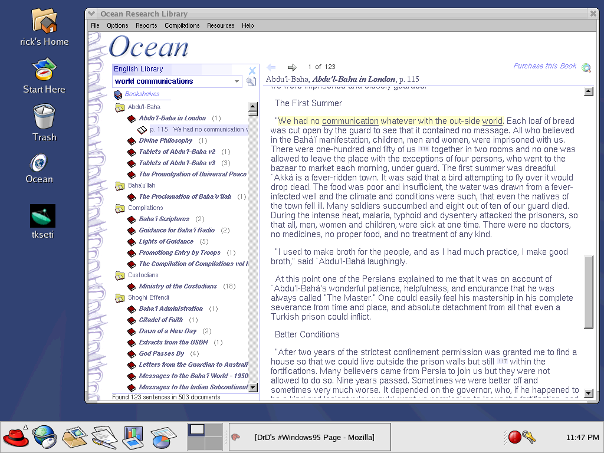

## A long time ago in a country far, far away...

Ocean 1.0 was one of the best projects ever. Although simplistic, it acheived the goal of making the core doctrinal literature of the World's major religions accessible and searchable to everyone.

It's simple interface and high-speed raw full-text search really made it feel like a high-performance inverted index search engine. But those were too big back then and we had to distribute the entire 23mb library (of text files) on a single mini-cd. There was no way we could pack in an inverted index.

No, instead, I used a hand-tuned assembler implementation of the Boyer-Moore search algorithm. That and creative memory-mapping of the text files made it into the little search engine that could.

