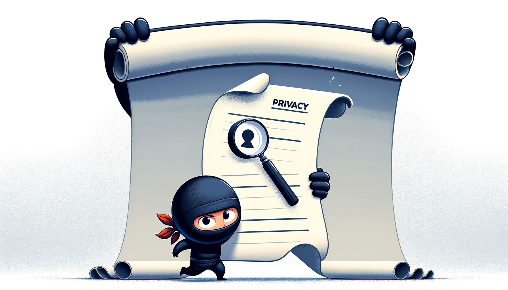

# Safeguarding Your Invisible Data!

Welcome, esteemed explorer of knowledge!

Here at Bahai-Education.org, we respect your privacy more than a ninja respects silence. And just to be clear:

- **No Cookies Here:** Our website is a cookie-free zone. Not even digital crumbs! You can roam freely, like a bird in the sky, without leaving a trace.

- **Data Collection:** What data? We believe in sharing knowledge, not collecting your personal info. Our website is like a diary with no lock, because there's nothing to hide!

- **Your Invisible Data:** We protect your non-existent data like a treasure chest of air. It's so safe, even we can't see it!

So, feel free to explore Bahai-Education.org with the peace of mind that your privacy is being guarded by... well, absolutely nothing, because we don't collect anything in the first place!

Happy learning!
